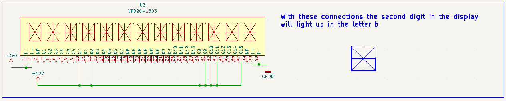

# VFD20-1303
Schematic symbol and guide on the usage of a vacuum fluorescent display (VFD)

In this image I have displayed the letter b on the display on the second position.
I am using an arduino to get 3V and a 12V battery to power on the display.
The connections that I have made are the same as the example_connection_3 shown in this schematic:

I should mention that I have not connected the 3.3V from the arduino to the display I have also connected 
a schottky diode with a voltage drop of 0.3V which gives the display the exact 3V that it needs.
